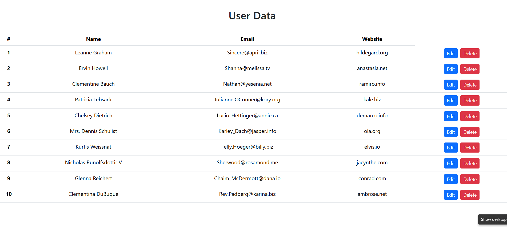

# 🌐 JavaScript User Data API

A responsive **User Data API** project built with **HTML5**, **Bootstrap 5**, and **JavaScript**. This application fetches user information from a REST API and dynamically displays it in a responsive Bootstrap table.

---

## 📖 Overview

This project demonstrates how to work with REST APIs using JavaScript's Fetch API. User information is retrieved from an external API, converted from JSON format, and rendered dynamically inside an HTML table.

It is an excellent beginner-friendly project for learning API integration, DOM manipulation, and dynamic content rendering.

---

## 📸 Project Preview



> If the image doesn't appear, use this URL:

```markdown

```

---

## ✨ Features

- 🌐 Fetch user data from a REST API
- 📋 Display data inside a responsive Bootstrap table
- 👤 Show user name, email, and website
- ⚡ Dynamic table generation
- 🎨 Clean and responsive UI
- 🛠️ Edit and Delete button interface
- 🚀 Beginner-friendly API project

---

## 🛠️ Technologies Used

- HTML5
- Bootstrap 5
- JavaScript (ES6)
- Fetch API
- REST API
- JSON

---

## 📚 JavaScript Concepts Used

- Functions
- Fetch API (`fetch()`)
- Promises (`.then()`)
- `response.json()`
- `forEach()`
- DOM Manipulation
- `document.getElementById()`
- `innerHTML`
- Template Literals
- Dynamic HTML Rendering
- API Integration

---

## 📂 Project Structure

```text
javascript-user-data-api/
│
├── index.html
├── main.js
├── preview.png
└── README.md
```

---

## 🚀 Getting Started

### Clone the Repository

```bash
git clone https://github.com/Joni250/javascript-user-data-api.git
```

### Run the Project

1. Clone or download the repository.
2. Open the project folder.
3. Launch `index.html` in your web browser.
4. The application will automatically fetch and display user data from the API.

---

---

## 🌐 Live Demo

**GitHub Pages**

```
https://joni250.github.io/javascript-user-data-api/
```

---

## 🎯 Learning Objectives

This project helped me practice:

- REST API Integration
- Fetch API
- JSON Data Handling
- DOM Manipulation
- Dynamic HTML Rendering
- Bootstrap Table Design
- JavaScript Fundamentals

---

## 💡 Future Improvements

- Search Users
- Pagination
- User Details Modal
- API Error Handling
- Loading Spinner
- Edit & Delete Functionality
- Responsive Enhancements

---

## 👩‍💻 Author

** Mst Joni Khatun**
Aspiring Front-End Developer

GitHub: https://github.com/Joni250

---

## ⭐ Support

If you found this project helpful, please consider giving it a ⭐ on GitHub.

It motivates me to continue building and sharing more web development projects.

---

## 📄 License

This project is licensed under the **MIT License**.
